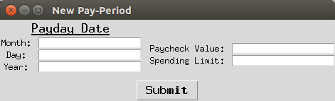

# Paycheck2Paycheck
Paycheck2Paycheck is a platform independent budgeting program specifically designed to manage your money one paycheck at a time. It is written in Python and uses the Tkinter GUI framework.

##Table of Contents
* [Product Goal](#goal)
* [Installing/Running Program](#install)
* [User Guide](#guide)
* [Screenshots](#screenshot)
* [Contributions](#contribute)
* [Questions or Comments](#questions)

<a name="goal" />
## What is the goal of this product?

By allowing you to set budgeting goals on a short term basis (more specifically, a single paycheck) Paycheck2Paycheck enables you to think big by working small. If you are in debt or are truly living paycheck to paycheck, it is imperative that that you control your expenses on a micro level. This means focusing on maximizing the potential of your available funds in the given pay period, as opposed to fixating on set monthly, quarterly, or yearly budget goals. Not only is this a more manageable approach, but it is also one of the best ways to become more aware of your spending habits, which is the ultimate goal of this product. 

<a name="other_budget_software" />
### Can't my current budgeting software do that?

Maybe, but probably not. You see, I am very enthusiastic about money management, but when it comes to budgeting software, I have never quite found the right match for me. For my purposes, they all seemed to be flawed in one way or the other: 

-----------------------------------------
##### I have tried smartphone apps that allow you to track your spendings as they happen in real-time.

But what if I'm in a rush (aren't we all)? While using these apps, I always found myself going
through my receipts or online banking statements and manually entering all of the day's (or week's) data at once. This was fine, but if I'm going to sit down at my computer and input all of this data at once, why not use an application on my computer? Why am I using my smartphone?

##### I have tried powerful budgeting software that linked into my banking information and did all of the work for me.

Wow. This is great... At least, it seemed great. The problem here is that keeping track of my spendings now just became way <em>too</em> easy. If I don't force myself to look at all of my receipts (or online statements) on a regular basis, my mind simply does not register them. Sure, my spendings are being tracked, but is this software really making me more aware of my spending habits? Not really, not for me at least. This is especially true when most of my transactions have been made via credit or debit cards. I think it is absolutely necessary that I review these expenses myself, otherwise it can become all too tempting to just keep spending away and deal with the consequences later. 

##### I have tried using spreadsheets and customizing them to track my spendings.

Now this I liked a lot, at first. But it was all to difficult to change the way these spreadsheets operated. And when I decided to switch operating systems, I found that those spreadsheets, the ones I had spent hours customizing to my liking, no longer worked the way they should. Now I'll admit, spreadsheets are an OK option for your personal finances; however, they can quickly become more work than they are worth and, as they begin to become more complicated, are prone to serious reliability issues. 

----------------------------------------

These grievances, however, do not expose what is, in my opinion, the biggest shortcoming shared by the most popular budgeting applications: They force you to set MONTHLY BUDGETS! What about those of us that live paycheck to paycheck? We do not have much in savings. We do not necessarily know how much we will make in income this month. And, most importantly, we can NOT afford to go over our budget before the next payday! 

This is where Paycheck2Paycheck steps in. We are not as much concerned with getting you through the month. We will settle on getting you to your next paycheck. Not only is this essential for the true paycheck to paycheck consumer, but it is also very helpful in regards to building consumer spending awareness. These are the two key visions that separate Paycheck2Paycheck from most other mainstream personal finance applications: budgeting goals on a per paycheck basis and an emphasis on elevating consumer spending awareness. 

<a name="install"/>
## How do I install and/or run this program?

#### I am a developer. How do I run this program?
This application requires that you have Python3 installed on your machine.

The main program can be started by running `python start.py`.

#### I am NOT a developer. How do I run this program?
If you do not intend on contributing to this project and would instead just like to try out the software, the easiest approach is to go to this project's [releases](https://github.com/bbugyi200/Paycheck2Paycheck/releases) and follow the instructions provided there to install Paycheck2Paycheck.

<a name="guide" />
## User Guide

#### First Use
When you start Paycheck2Paycheck for the first time, you will be asked to setup your first Paycheck. Enter in the payday date (the date your received your paycheck), the paycheck's value, and your spending limit (this is how much money you *expect* to spend before your next paycheck). When you are finished, hit the **Submit** button.

#### Starting a new Paycheck
You can start a new Paycheck at any time by selecting **File >> New Paycheck** and then filling in the requested information about the new Paycheck.

#### Miscellaneous
* The current version of Paycheck2Paycheck does NOT include a **Save** button. Your data is saved automatically after every change.
* You can access previous Paychecks by going to **Paychecks** and then selecting the Paycheck that you would like to load. 

<a name="screenshot" />
## Screenshot of Version 1.0

<a name="contribute" />
## How can I contribute?

I would gladly accept outside contributions to this project. If you would like to contribute, please email me at bryan_bugyi@mymail.rcbc.edu.

<a name="questions" />
## Where can I submit my questions or comments?
If you have any comments or questions about this software, its dependencies, or how you can contribute, please email me at bryan_bugyi@mymail.rcbc.edu.

