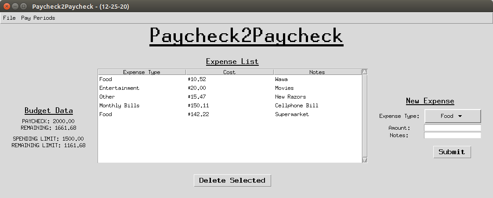

# What does it do?

Paycheck2Paycheck is a platform independent budgeting program specifically designed to manage your money one paycheck at a time.

# Why does it do it?

By allowing you to set budgeting goals on a short term basis (more specifically, a single pay period) Paycheck2Paycheck enables you to think big by working small. If you are in debt or are truly living paycheck to paycheck, it is imperative that that you control your expenses on a micro level. This means focusing on maximizing the potential of your available funds in the given pay period, as opposed to fixating on set monthly, quarterly, or yearly budget goals. Not only is this a more manageable approach, but it is also the best way to become better aware of your spending habits, which is the ultimate goal of this product. 

# Can't my current budgeting software do that?

Maybe, but probably not. You see, I am very enthusiastic about money management. But when it comes to budgeting software, I have never quite found the right match for me. For my purposes, they all seemed to be flawed in one way or the other. 

-----------------------------------------
##### I have tried smartphone apps that allow you to track your spendings as they happen in real-time.

But what if I'm in a rush (aren't we all)? While using these apps, I always found myself going
through my receipts or online banking statements and manually entering all of the day's (or week's) data at once. This was fine, but if I'm going to sit down at my computer and input all of this data at once, why not use an application on my computer? Why am I using my smartphone?

##### I have tried powerful budgeting software that linked into my banking information and did all of the work for me.

Wow. This is great... At least, it seemed great. The problem here is that keeping track of my spendings now just became way <em>too</em> easy. If I don't force myself to look at all of my receipts (or online statements) on a regular basis, my mind simply does not register them. Sure, my spendings are being <em>tracked</em>, but is this software really making me more aware of my spending habits? Not really. Not for me at least. This is especially true when most of my transactions have been made via credit or debit cards. I think it is imperative that I review these expenses myself, otherwise it can be all too easy to just keep spending away and deal with the consequences later. 

##### I have tried using spreadsheets and customizing them to track my spendings.

Now this I liked a lot, at first. But it was all to difficult to change the way the spreadsheet operated. And when I decided to switch operating systems, I found that those spreadsheets, the ones I had spent hours customizing to my liking, no longer worked the way they should. Now I'll admit, spreadsheets are an OK option for your personal finances; however, they can become way too much work and, as you make them more complicated, are prone to serious reliability issues. 

----------------------------------------

These grievances, however, do not expose the worst of the problems. Most personal finance programs force you to set MONTHLY BUDGETS! What about those of us that live paycheck to paycheck? We do not have much in savings. We do not necessarily know how much we will make in income this month. And, most importantly, we can NOT afford to go over our budget before the next payday! 

This is where Paycheck2Paycheck steps in. We are not so much concerned with getting you through the month; we will settle on getting you to your next paycheck. Not only is this essential for the true paycheck to paycheck consumer, but it is also very helpful in regards to building consumer spending awareness. These are the two key goals that separate Paycheck2Paycheck from most other mainstream personal finance applications: budgeting goals on a per paycheck basis and elevated consumer spending awareness. 

# How can I contribute?

I would gladly accept outside contributions to this project. If you would like to contribute, please email me at bryan_bugyi@mymail.rcbc.edu.

# Running the Budget Program
This program requires that you have Python3 installed on your machine.

The program can be started by running `python start.py`.

#Questions or Comments?
If you have any comments or questions about this software, its dependencies, or how you can contribute, please email me at bryan_bugyi@mymail.rcbc.edu.

#Screenshot of Version 1.0

