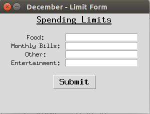
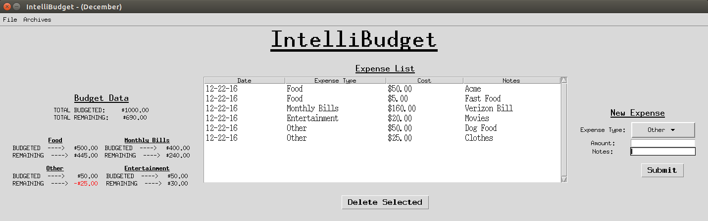

# IntelliBudget
IntelliBudget is a platform independent personal budgeting application complete with a graphical user interface (implemented using Python's Tkinter library) and an SQL database designed to store user expense data.

## Table of Contents
* [Installing/Running Program](#install)
* [User Guide](#guide)
* [Screenshots](#screenshot)
* [Contributions](#contribute)
* [Questions or Comments](#questions)

<a name="install"/>
## How do I install and/or run this program?

#### I am a developer. How do I run this program?
This application requires that you have Python3 installed on your machine.

IntelliBudget can be launched by running `python start.py` from your terminal.

#### I am NOT a developer. How do I run this program?
If you do not intend on contributing to this project and would instead just like to try out the software, the easiest approach is to go to this project's [releases](https://github.com/bbugyi200/IntelliBudget/releases) and follow the instructions provided there to install IntelliBudget.

<a name="guide" />
## User Guide

#### First Use
When you start IntelliBudget for the first time of a new month, you will be asked to setup your desired spending limits for this month. When you are finished, hit the **Submit** button.

#### Miscellaneous
* The current version of IntelliBudget does NOT include a **Save** button. Your data is saved automatically after every change.
* You can access data from previous months by selecting the **Archives** menu option and then selecting the month that you would like to load. 

<a name="screenshot" />
## Screenshots

<a name="contribute" />
## How can I contribute?

I would gladly accept outside contributions to this project. If you would like to contribute, please email me at bryan_bugyi@mymail.rcbc.edu.

<a name="questions" />
## Where can I submit my questions or comments?
If you have any questions or comments about this software, its dependencies, or how you can contribute, please email me at bryan_bugyi@mymail.rcbc.edu.
